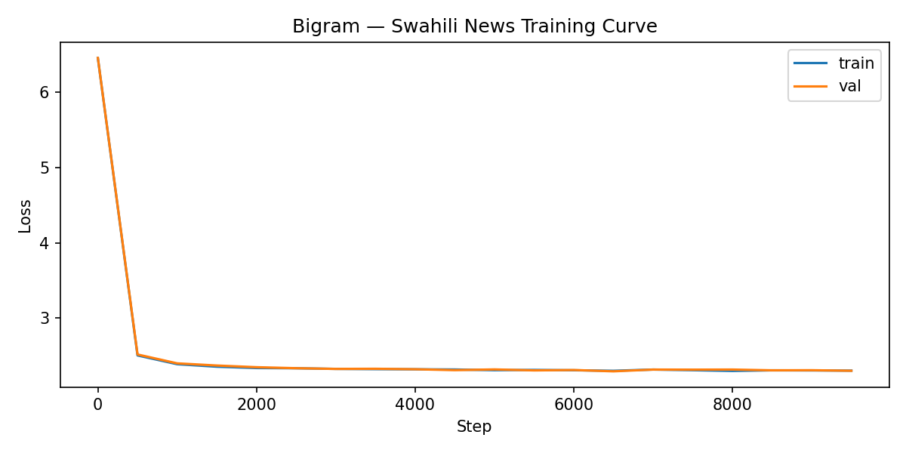
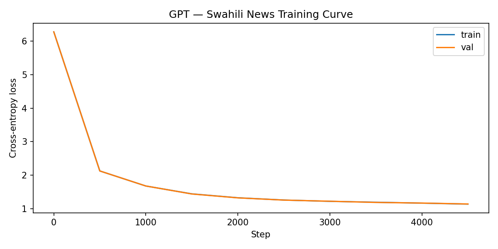
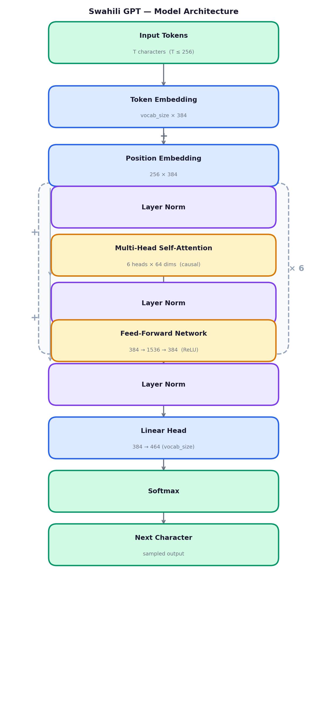

# Swahili GPT

A character-level language model trained on Swahili news articles, built to explore how a GPT-style Transformer performs on an East African language with rich morphological structure.

Two models are implemented and compared:

| Model | Architecture | Parameters |
|-------|-------------|-----------|
| `bigram.py` | Token + position embeddings -> linear head | ~200K |
| `gpt.py` | 6-layer decoder-only Transformer | 11M |

Both are trained at the character level, meaning the model learns Swahili spelling, morphology, and partial syntax from scratch with no prior language knowledge.

---

## Why Swahili?

Swahili (Kiswahili) is spoken by 100–150 million people across East Africa and is the official language of Kenya, Tanzania, Uganda, and the African Union. Despite this, it remains severely under-represented in NLP research compared to European languages.

Training a generative model on Swahili explores:
- How character-level models handle agglutinative morphology — Swahili words carry tense, subject, and object agreement as prefixes and suffixes
- The difference in vocabulary complexity compared to English — Swahili has a smaller character set but denser morphological structure per token
- A baseline for future work on low-resource African language modeling

---

## Dataset

**Swahili News** — [HuggingFace `swahili_news`](https://huggingface.co/datasets/swahili_news)

- 29,544 news articles from Tanzanian online platforms
- 65 million characters, ~9.7 million words
- Categories: local, international, business, health, sports, entertainment
- License: CC BY 4.0

The dataset is downloaded and prepared automatically by `data/prepare.py`.

## Model Checkpoint

- HuggingFace: [RamadhanZome/swahili-gpt](https://huggingface.co/RamadhanZome/swahili-gpt)
- GitHub Releases: [v1.0](https://github.com/RamadhanAdam/swahili-gpt/releases/tag/v1.0)

---

## Project Structure

```
swahili-gpt/
├── assets/
│   ├── architecture.png            # model architecture diagram
│   ├── bigram_loss.png             # bigram training curve
│   └── gpt_loss.png                # GPT training curve
├── data/
│   ├── prepare.py                  # downloads and saves the Swahili corpus
│   └── swahili.txt                 # generated by prepare.py (not committed)
├── bigram.py                       # baseline bigram model
├── gpt.py                          # full GPT Transformer model
├── generate.py                     # interactive generation from saved checkpoint
├── swahili_gpt_training.ipynb      # Colab training notebook
├── requirements.txt
├── LICENSE
└── README.md
```

---

## Quickstart

### 1. Install dependencies

```bash
pip install -r requirements.txt
```

### 2. Download the corpus

```bash
python data/prepare.py
```

Saves 29,544 Swahili articles (~65MB) to `data/swahili.txt`.

### 3. Train the bigram baseline

```bash
python bigram.py
```

Trains in under a minute on GPU. Outputs `bigram_loss.png`.

### 4. Train the GPT model

```bash
python gpt.py
```

Trains for 5,000 steps. Saves checkpoint to `gpt_swahili.pt` and outputs `gpt_loss.png`.

GPU recommended. MPS (Apple Silicon) and CUDA are auto-detected. On CPU expect 2–3 hours.

### 5. Generate interactively

```bash
# Interactive prompt loop
python generate.py

# Single-shot with a prompt
python generate.py --prompt "Rais wa Tanzania alisema" --tokens 400

# Adjust creativity
python generate.py --temperature 0.8 --tokens 600
```

### 6. Run on Google Colab

Open `swahili_gpt_training.ipynb` in Colab with a T4 GPU runtime. All steps are pre-configured — clone, prepare, train, and download plots in one session.

---

## Training Results

**Bigram model** — 10,000 steps, ~200K parameters

| Step | Train Loss | Val Loss |
|------|-----------|---------|
| 0 | 6.4527 | 6.4534 |
| 5000 | 2.3105 | 2.3207 |
| 9500 | 2.3049 | 2.3031 |

Final loss: **2.2873**



**GPT model** — 5,000 steps, 11M parameters

| Step | Train Loss | Val Loss |
|------|-----------|---------|
| 0 | 6.2798 | 6.2793 |
| 2500 | 1.2566 | 1.2548 |
| 4500 | 1.1350 | 1.1387 |

Final loss: **1.1500**



The GPT model achieves roughly half the loss of the bigram baseline, reflecting the Transformer's ability to model long-range character dependencies across a 256-character context window.

---

## Architecture Notes

### Bigram (baseline)

```
Input tokens
    -> Token Embedding   (vocab_size x 32)
    -> Position Embedding (block_size x 32)
    -> Linear Head       (32 -> vocab_size)
    -> Cross-entropy loss
```

No attention. Each character predicts the next purely from its embedding. Serves as a lower-bound baseline.

### GPT (full model)

```
Input tokens
    -> Token Embedding    (vocab_size x 384)
    -> Position Embedding (256 x 384)
    -> 6 x Transformer Block:
          LayerNorm
          Multi-Head Causal Self-Attention  (6 heads x 64 dims)
          Residual connection
          LayerNorm
          Feed-Forward Network (384 -> 1536 -> 384, ReLU)
          Residual connection
    -> LayerNorm
    -> Linear Head  (384 -> vocab_size)
    -> Cross-entropy loss
```

### Architecture Diagram



Trained with AdamW (lr=3e-4), dropout=0.2, context window of 256 characters.

---

## Observations on Swahili

**Bigram generated sample:**

```
Uwaikimopezusemangachianza wa kus ka we,0 ndwa libana hapizilitungufurematpalida wianilgikulite.
Fi kulizifu manzumona ha ihonjusshili TKi ali, nikotojezwa mba kungima kupue mozahejinguha
```

**GPT generated sample:**

```
Mahakama ya Idadi ya Kang zinazotumbulika kwa Sokonda kama amewahi kufanya nao Kenyati ya Dunga
hadi ikufanyika katika Kikwsi cha Shirika la Afrika, Lemares TNgan'Dinnse inahitimu kwenye kikao
cha Aggramida iliyopo Eustaal Bwiters wametoa vitendo Ujumani kwa maokocha wa maisa.
```

Key observations:

- The GPT model learns real Swahili vocabulary — words like *mahakama* (court), *shirika* (organisation), *sheria* (law), and *milioni* (million) appear correctly formed.
- Swahili noun class prefixes are partially learned. The model generates *kikao* (meeting, ki- class), *vitendo* (actions, vi- class), and *wametoa* (they have provided, wa- subject prefix) — all grammatically valid constructions.
- Verb agreement prefixes such as *amewahi* (he has ever), *inahitimu* (it graduates), and *wametoa* show the model has picked up subject-verb agreement patterns from character-level statistics alone.
- The bigram model produces recognisable Swahili fragments — short common words like *wa*, *na*, *ku*, *ni* — but fails at word boundaries and produces mostly noise beyond single syllables.
- The GPT model occasionally produces named entities (*Trump*, *Afrika*, *Januari*) that reflect the news domain of the training data.
- With more training steps and a larger dataset, this approach could serve as a useful baseline for low-resource Swahili NLP research.

---

## Acknowledgements

This project was inspired by Andrej Karpathy's work on character-level language models and the nanoGPT architecture. The Swahili corpus adaptation, dataset preparation, checkpoint saving, training curve plotting, and interactive generation script are original contributions.

---

## License

MIT — see [LICENSE](LICENSE).